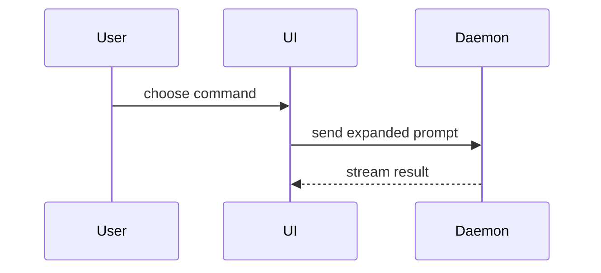

Show the current topic as a picture. No preamble, little prose. Pick the
smallest view that makes the point.

- Show logic or an algorithm as pseudocode:

```text
on(save)
  if content is unchanged
    return cached result
  write new content
  return fresh result
```

- Show runtime control flow as a call tree:

```text
submitForm
  createSession
    persistPrompt
    launchAgent
  navigateToSession
```

- Show UI structure as a component tree. Keep the state and module lines that
  matter:

```tsx
<SessionPage> (apps/example/src/routes/session.tsx)
  useSessionEvents()
  <SessionToolbar>
    <RunSkillButton> (packages/ui)
```

- Show who owns what, or a wide refactor, as a shallow file tree:

```text
src/
├── commands/       # parses user actions
├── sessions/       # owns session state
└── transport/      # sends API requests
```

- Show how parts talk, or how control or data flows, with Mermaid:



- Use `diff` when the point is the change and the shape around it exists.
  Diff the same view the topic uses.

For a component change:

```diff
 <SessionPage>
   useSessionEvents()
   <SessionToolbar>
+    <RunSkillButton />
   <SessionTimeline>
+    <SkillResultCard />
```

For a file-layout change:

```diff
 src/
 ├── commands/
+│   └── show-me.ts       # expands the slash command
 ├── sessions/
-└── transport.ts
+└── transport/
+    ├── client.ts
+    └── stream.ts
```

For a call-tree or call-stack change:

```diff
 submitForm
   createSession
     persistPrompt
+    expandSkillMention
     launchAgent
-  navigateToSession
+  navigateToSession
+    subscribeToEvents
```

For a state or control-flow change:

```diff
 on(save)
-  write content
+  if content is unchanged
+    return cached result
+  write new content
+  invalidate cache
```

- Show the whole block when most of it is new, when a cut would hide owner or
  order, or when the user needs a shape to copy:

```ts
function expandSkill(command: string): string {
  const skillName = command.slice(1);
  return `use the ${skillName} skill`;
}
```

- For a UI, a layout, a side-by-side of states, or an idea too dense for
  Mermaid, write one focused HTML file. Make it a diagram, a one-page
  poster, or a short slide deck, whichever fits. Use the product's colors,
  type, spacing, and parts. Use real labels and data. Make it work on a
  phone. Name it `show-me-<topic>.html`, then share it with the `preview`
  skill (or give the path).

## Guidance

- Put each picture next to the short text it backs.
- Keep only the calls, files, props, states, and lines that answer the
  current question, or that show the options for the current choice.
- Use one view, or a few. Rarely all. Do not bury the user.
