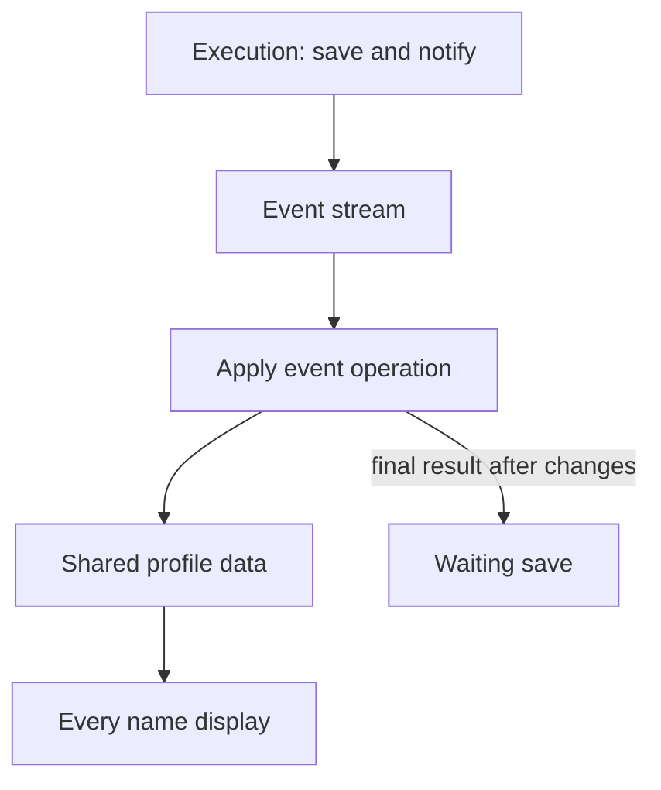

# One update path and execution results

Date: 2026-10-02.
Status: model accepted; public and private runtime proof built.

## Precedent

The model combines one shared record per ID with a request and its later result.
The existing [mail decision](../../decisions/0075-stack-v1-picks-tanstack-router-pg-boss-better-auth-mail-through-a-job.md)
already separates a database commit from a later send.
This scaffold keeps its own graph and uses only Core and React from Tinker.

## Complete means the required work finished

Each operation declares its completion goal: the work needed to report complete.
Here, the user's desired scope means that work.
A Core scope still owns live state, clients, work, and cleanup.
The two meanings stay separate.

A database-only save is complete after commit.
A save that also requires a notification is complete after both succeed.
For mail, success means SMTP acceptance, as in the existing scaffold contract.
It does not mean proof that the mail reached an inbox.
A saved profile with a failed notification has a partial result.
The failed notification does not undo the saved profile.

## The graph



The mutation response returns an execution ID, or an early failure.
The browser registers a request ID first; the server acknowledges that same ID.
This keeps retry and events arriving before a reply tied to the same execution.
The ID identifies the cause of an event; it is not proof of completion.
Only sync operations write shared saved records, including the first snapshot.
The mutation operation does not also write its returned value into those records.
Views read the same profile record instead of keeping copies of its name.
An editor owns its draft separately, so remote changes leave unsaved text intact.

Change events publish committed changes as soon as they are available.
Result events report complete, partial, or failed for the declared goal.
Several change events can share one execution ID.
A change event alone does not finish the waiting mutation.
The wait ends after the final result and its earlier changes have been applied.
A remote execution updates shared records even when this tab has no matching wait.

## A result that keeps saved work usable

For an operation that saves a profile and sends a notification:

```ts
type SaveProfileResult =
  | { kind: "complete"; profileId: string }
  | {
      kind: "partial";
      profileId: string;
      notification: { kind: "failed"; message: string };
    }
  | { kind: "failed"; message: string };
```

Complete means the profile committed and the notification was accepted.
Partial means the profile committed and the notification failed.
Failed means this attempt did not commit its profile change.
The result refers to shared data by ID; it carries no second profile copy.
The partial branch requires a saved profile ID and a notification failure.
The failed branch has no saved profile ID from this attempt.

The final event resolves the execution wait with that result.
Partial is a usable result, so the UI can say Name saved; notification failed.
A retry targets the failed notification, preserving the completed save.
Each execution has one final result; a later retry has its own execution ID.
Work that is still running or waiting for a planned retry is not final yet.

## Units and owners

- **Resources:** the sync connection and execution waits belong to one signed-in account owner.
  Cleanup stops the connection and ends local waits when that owner exits.
- **Operations:** send a mutation, apply a change, and apply an execution result.
  Their inputs declare their types; business code receives no scope object.
- **Data:** shared saved records, local drafts, and each action's named state.
  A view reads the same record used by the other views.
- **Tags:** fixed connection settings bound by the entry.

Core owns the lifetime, signals, and observation of these units.
The app owns the event contract, completion goals, and database event history.
Closing a local wait does not claim to undo a committed server execution.

## Ordering and recovery

Remember a final result that arrives before its mutation response.
Registering that execution ID later must find the result and finish the wait.
Duplicate events must not repeat a change or finish a wait twice.
An execution ID matches causes; separate event IDs order changes and support replay.
Store each database change and its change event in the same transaction.
Store later execution results so reconnect can recover them too.
A lost connection leaves the server outcome unknown until sync recovers it.
It must not turn a committed save into a failed save in the UI.

## Runtime proof still needed

- Two views show the same local or remote profile change.
- A dirty draft survives a remote change.
- An event before the response still finishes the right wait.
- Replayed events neither repeat changes nor finish another execution.
- Failed mail yields partial while the saved name stays usable.
- Sign-out stops local waits and ignores late replies from the old account.

The current app still finishes saves through direct server replies and loader invalidation.
The public and private app now implements this model.
The [track proof](PROGRESS.md#public-and-private-sync-slice) records its checks.
The [code page](https://p-32fb45e2fd6a.preview.tini.works) embeds the editable graph.
