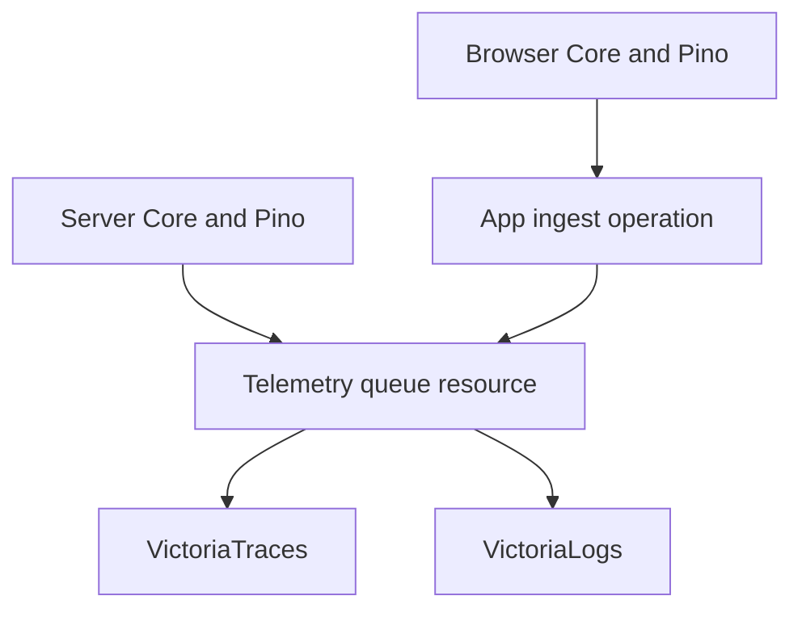

# Start Victoria storage

Owner: lead Codex; Sol app writer.
Use the fixed contributor brief and coding convention.
Work only in the assigned worktree.

## Target

Send Core spans and Pino logs from both sides to local
VictoriaTraces and VictoriaLogs.
Keep every Tinker app dependency limited to Core and React.
The exporter is copied source in the scaffold.

The user chose a local Victoria stack for now.
The lead owns local service setup, registry, docs, and browser proof.
Do not change deployed services or shared host settings.

## Graph and precedent

Borrow OTLP/HTTP for traces and VictoriaLogs JSON lines for Pino.
Core already owns tracing; add no second tracer or context store.
Use the separate telemetry root from ADR 0091.
Its own work stays unobserved, so exporting does not export itself.



- A resource owns the queue, bounds, timers, and flush lifetime.
- Operations ingest and export; tags hold fixed settings.
- Core data holds bounded local history and export health.
- Business actions need no export calls.
- Keep native imports lazy; type imports may be static.
- No context or scope arguments to helpers.
- Create roots and original stop signals only at entries.

## Transport

Use exact configurable trace and log ingest URLs.
Local defaults are:

```text
http://127.0.0.1:10428
  /insert/opentelemetry/v1/traces
http://127.0.0.1:9428
  /insert/jsonline
```

The actual URLs have no newline.
Pino fields: `time`, `msg`, `level`, `service`, `side`,
`traceId`, and `spanId` when present.
Use the VictoriaLogs time/message/stream field settings.
Service and side identify streams; trace IDs are regular fields.

The browser sends a bounded, validated batch to the app's
same-origin native Start route `/api/telemetry`.
Use the existing extension-bound request middleware.
Keep storage addresses and keys server-only.
This public-page endpoint checks origin, body size, and record count.
It accepts only the shipped trace/log record shape, not a target URL.
Never trust browser records as audit facts.

Traces use OTLP JSON with decimal-string nanosecond times,
hex IDs, real parent links, Core kind, status, and events.
VictoriaTraces supports this format; see its current
`otlphttp.go` and official quick-start example.
The existing stack encoder is precedent, not an app dependency.
Copy only the wire mapping that is needed.
Validate outside-process records once at the route door.

Pino remains the log formatter on both sides.
Connect its actual output to the owned queue.
Keep local Pino output and bounded devtool history working.
Do not merely print logs and call that storage.

## Lifetime and failure

Use bounded batches, bounded retained records, one tracked flush,
and a Core-clock scheduled flush while the telemetry owner lives.
Retain a failed batch for retry within the bound.
Do not spin, drop promises, or recurse through app observation.
Store a discriminated export state with the last failure/drop count.
A storage failure never changes a business result.
Close the app first; then flush and close telemetry with a bound.
The browser page-hide path may use native keepalive delivery
within the same bounded body contract.
A storage outage must not block root close forever.

Do not create a broad exporter driver system or collector package.
No new dependencies are needed for fetch and JSON.
Keep frontend and backend modules separated by Start's native rules.

## File ownership

You own app telemetry source, the ingest route, its seam tests,
and telemetry-only entry/settings/env edits.
SSE writer owns stream source and the Node host shutdown change.
Both use separate worktrees; the lead combines reviewed hunks.
Do not edit registry payloads, shared docs, lockfile, or Core.

## Proof

- Run an operation through an observed Core scope and export its
  real span/log to a real local HTTP receiver.
- Verify wire timestamps, status/events/IDs, Pino fields, and side.
- Verify storage failure leaves the operation result intact and
  export health records the failure.
- Verify graceful flush and bounded close with a stuck receiver.
- Verify browser ingest rejects wrong origin, oversized bodies,
  bad records, and caller-supplied destination URLs.
- Tests import public app seams; no mocks or sleep waits.
- Build first; app tests, check, native import/boundary checks,
  TSDoc, style census, and Jev advisory report.
- The lead proves actual records can be queried from both
  Victoria services and proves the browser path through Start.

No push, merge, release, or mutation lane for this app proof.
Send the concrete queue/entry shape before writing source.
