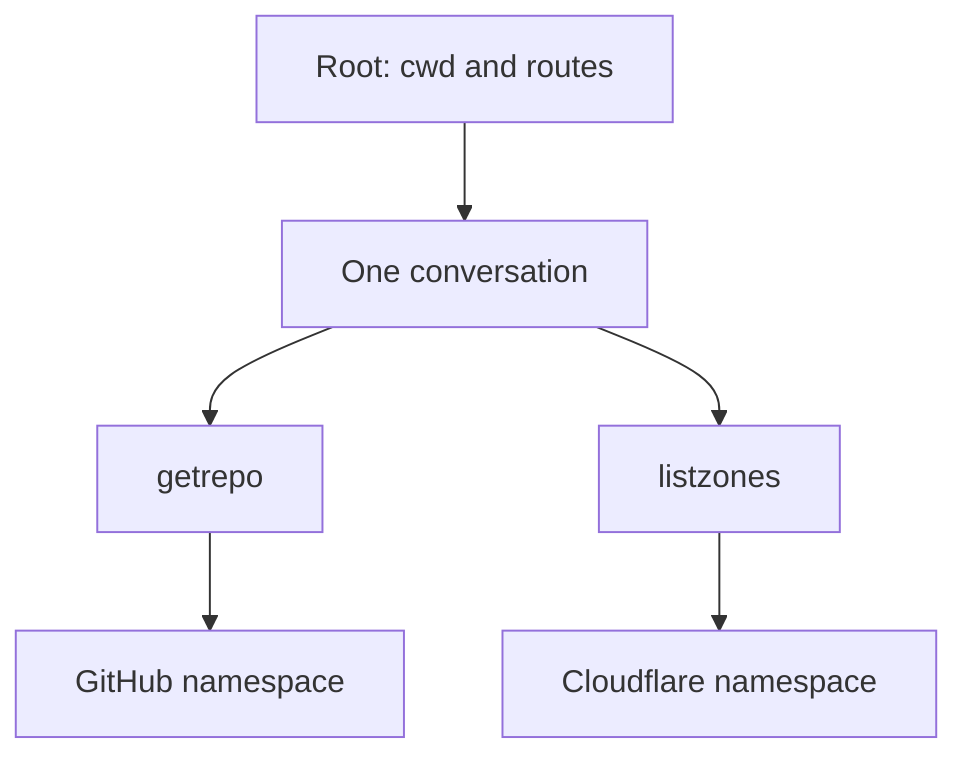

# One agent, two services

[services.ts](services.ts) gives one Claude Code agent two tools.
It reads GitHub repositories and Cloudflare zones.
Each service has its own HTTP URL and Bearer token.



## The graph

- **Tags:** `serviceRoutes` holds two namespace keys.
  `serviceTags` chooses them when the root is wired.
  HTTP `config` holds each URL and token.
- **Operations:** `getRepo` and `listZones` make requests.
  Each selects its namespace on `send.run`.
  Both use the same HTTP `send`, `attempt`, and `backend`.
- **Data:** Harness owns the agent's status, text, and items.
- **Resource:** Harness owns the SDK thread in the session.
  Both tools and all turns share that conversation.
- **Engine:** Harness borrows Claude Code's agent engine.
  This example needs no added extension.
  The frame already owns its thread and cleanup.

The graph is declared once, outside the root.
Namespaces choose settings; they do not own lifetimes.
Two roots can use the same graph and namespace keys.
Closing one root leaves the other root usable.

The root binds one shared `cwd` through `claudeCode.options`.
The two MCP tools are the full toolkit.
Built-in tools, disk settings, and skills are disabled.
Any extra approval request is denied.

## Tool calls

`getrepo` takes owner and repo fields:

```json
{ "owner": "octocat", "repo": "Hello-World" }
```

It returns name, URL, private flag, description, and stars.
The fields are trimmed and parsed by the operation's Zod schema.
The request path encodes each field.

`listzones` takes an optional name filter:

```json
{ "name": "example.com" }
```

It returns page 1 with at most 50 zones.
Each zone has an ID, name, and status.
An empty input object omits the filter.
This tool does not fetch later pages.

Both tools accept only HTTP 2xx replies.
A non-2xx reply fails before its body is read.
`response.json(schema)` reads and validates each body once.
Bad fields and Cloudflare `success: false` fail the tool call.
The MCP rows map the parsed values to JSON text for the agent.

## Run with live accounts

Use a shell with Claude Code auth already set.
Set `GITHUB_TOKEN` and `CLOUDFLARE_API_TOKEN` there.
The entry checks tokens and prompts before opening the root.
An `InvalidSettings` error names fields without storing tokens.
The entry removes one leading `--` from the arguments.
That task separator is never sent as a prompt.

From the repo root:

```bash
vp install
vp run -r build
cd examples/harness
vp run services -- \
  "Read octocat/Hello-World and zones for example.com." \
  "Read them again and compare with your last answer."
```

Each quoted argument is one turn in the same session.
The second turn resumes the first turn's SDK session ID.
The same in-process MCP server serves both turns.
When the prompts finish, the stop signal closes the root.
The entry waits for `closed` before returning.

API sources checked on 2026-09-30:

- [GitHub: get a repository][github].
  `GET /repos/{owner}/{repo}` uses a Bearer token.
  A fine-grained token needs Metadata read access.
  The example sends API version `2026-03-10`.
- [Cloudflare: list zones][cloudflare].
  `GET /client/v4/zones` uses a Bearer token.
  Give the token Zone read access for the zones you need.

## Run without accounts

```bash
cd examples/harness
vp test
```

[services.test.ts](services.test.ts) replaces the public SDK resource
with a fake and binds a recording HTTP backend.
It checks full URLs, separate tokens, parsed replies, the shared
conversation, root cleanup, toolkit limits, and failed replies.
It makes no live account calls.
The package test task also runs under `vp run -r test`.

[github]: https://docs.github.com/en/rest/repos/repos?apiVersion=2022-11-28#get-a-repository
[cloudflare]: https://developers.cloudflare.com/api/resources/zones/methods/list/
